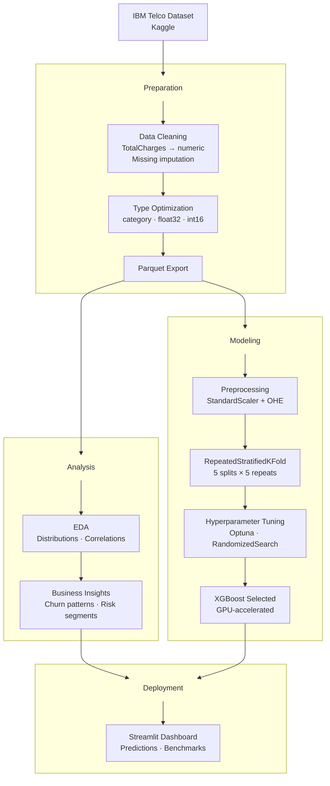
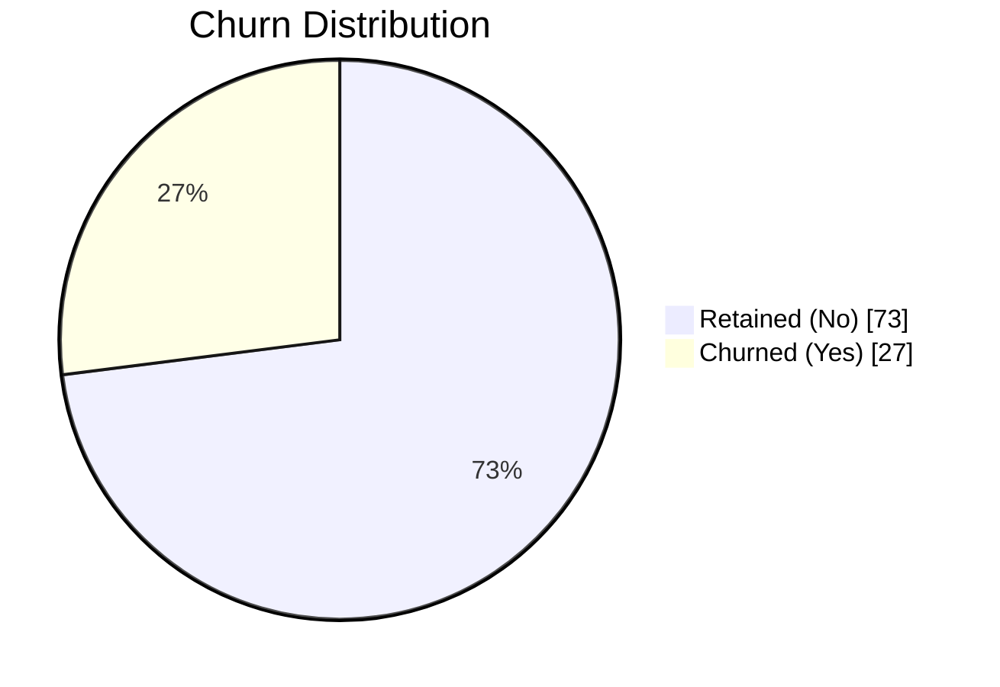
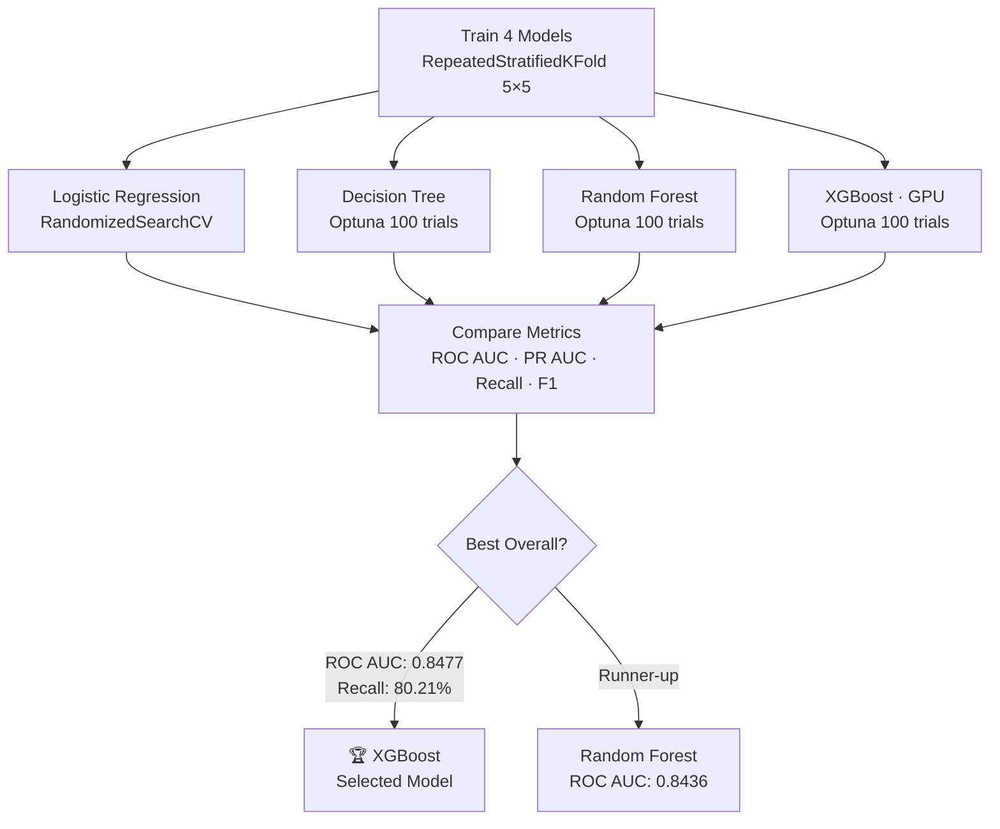

<div align="center">

# ChurnLab

**Predicting telecom customer churn with Machine Learning, XGBoost and Streamlit.**


<br>

[](https://skillicons.dev)

<br>


</div>

---

## Table of Contents

- [ChurnLab](#churnlab)
  - [Table of Contents](#table-of-contents)
  - [Live Demo](#live-demo)
  - [Highlights](#highlights)
  - [About](#about)
  - [Project Structure](#project-structure)
  - [Pipeline](#pipeline)
  - [Key Findings](#key-findings)
  - [Model Selection](#model-selection)
  - [Results](#results)
    - [Selected model](#selected-model)
    - [Metric rationale](#metric-rationale)
  - [Getting Started](#getting-started)
    - [Quick Start (Dev Container)](#quick-start-dev-container)
      - [Prerequisites](#prerequisites)
      - [Steps](#steps)
    - [Full Pipeline Reproduction](#full-pipeline-reproduction)
      - [Option 1 — Dev Container](#option-1--dev-container)
      - [Option 2 — Local (uv)](#option-2--local-uv)
      - [Run the notebooks](#run-the-notebooks)
      - [Running the Dashboard](#running-the-dashboard)
  - [Performance Summary](#performance-summary)
  - [Dataset](#dataset)
  - [License](#license)

---

## Live Demo

<div align="center">

[](https://churnlab.streamlit.app/)

<a href="[ChurnLab](https://churnlab.streamlit.app/)">
  
</a>

</div>

---

## Highlights

- **End-to-end ML pipeline** — from raw data to deployed dashboard
- **Automated preprocessing** — type optimization, missing handling, Parquet export
- **Robust cross-validation** — `RepeatedStratifiedKFold` (5×5) with class imbalance handling
- **Hyperparameter optimization** — Bayesian tuning via Optuna (300+ trials)
- **GPU-accelerated XGBoost** — CUDA 12.9 for fast training
- **Interactive dashboard** — Streamlit app with predictions, benchmarks & i18n (EN/PT-BR)
- **Reproducible environment** — Docker & Dev Containers, `uv` package manager

---

## About

Customer churn is one of the most critical problems in subscription-based businesses. Retaining an existing customer is significantly cheaper than acquiring a new one — making early churn detection a high-value machine learning application.

**ChurnLab** takes the [IBM Telco Customer Churn](https://www.kaggle.com/datasets/blastchar/telco-customer-churn) dataset through a complete data science workflow: from raw data ingestion and exploratory analysis to hyperparameter-tuned classification models and an interactive prediction dashboard.

---

## Project Structure

```
churnlab/
│
├── data/
│   ├── raw/                        # Raw CSV (Kaggle)
│   ├── interim/                    # Cleaned data for EDA
│   └── processed/                  # Modeling-ready data
│
├── notebooks/
│   ├── 01_data_preparation.ipynb     # Type optimization, cleaning, export
│   ├── 02_exploratory_analysis.ipynb # EDA, correlations, insights
│   └── 03_model_training.ipynb       # Training, tuning, evaluation
│
├── models/                         # Trained pipelines (.joblib)
│   ├── logistic_regression/
│   ├── decision_tree/
│   ├── random_forest/
│   └── xgboost/
│
├── reports/                        # model_comparison.csv
│
├── app/                            # Streamlit dashboard
│   ├── app.py
│   ├── .streamlit/
│   ├── components/
│   ├── locales/
│   ├── pages/
│   ├── services/
│   └── utils/
│
├── scripts/                        # Shell automation scripts
├── .devcontainer/                  # Dev Container config
├── Dockerfile
├── compose.yaml
├── Makefile
├── pyproject.toml
└── README.md
```

---

## Pipeline



---

## Key Findings

> From `02_exploratory_analysis.ipynb`



- **Month-to-month contract** holders churn at significantly higher rates than annual subscribers
- **Short tenure (< 12 months)** is the strongest behavioral signal — most churn happens early in the customer lifecycle
- Customers with **higher monthly charges and no tech support** are disproportionately represented among churners
- **Fiber optic** internet service correlates with higher churn than DSL

---

## Model Selection



---

## Results

Four classification models evaluated with `RepeatedStratifiedKFold` (5 splits × 5 repeats).
`scale_pos_weight` is derived from the training fold to handle the ~73/27 class imbalance without data leakage.

| Model | ROC AUC | F1-Score | Recall | Inference |
|-------|--------:|---------:|-------:|----------:|
| 🥇 **XGBoost** | **0.8477** | 0.6270 | **80.21%** | 10.73 ms |
| 🥈 Random Forest | 0.8436 | **0.6359** | 79.14% | 23.73 ms |
| 🥉 Decision Tree | 0.8349 | 0.6356 | 78.34% | **6.17 ms** |
| Logistic Regression | 0.8395 | 0.6139 | 77.81% | 6.88 ms |

> Full results in [`reports/model_comparison.csv`](reports/model_comparison.csv).

### Selected model

XGBoost achieved the highest **ROC AUC (0.8477)** and **Recall (80.21%)**, making it the most effective model for identifying customers at risk of churn. Its GPU acceleration via CUDA keeps inference fast at ~10.73 ms per prediction.

### Metric rationale

| Metric | Reason |
|--------|--------|
| **ROC AUC** | Primary metric — evaluates discriminative power across all decision thresholds |
| **PR AUC** | Precision-Recall AUC; more informative than ROC AUC under class imbalance |
| **Recall** | Catching churned customers matters more than avoiding false alarms |
| **Precision** | Ensures retention campaigns aren't wasted on stable customers |
| **F1-Score** | Harmonic balance between Precision and Recall |
| **Inference** | Prediction latency on the held-out test set |

---

## Getting Started

### Quick Start (Dev Container)

The fastest way to explore the project. **No notebooks required** — pre-trained models are already versioned in the repository.

#### Prerequisites

- [Docker](https://docs.docker.com/get-docker/) + Docker Compose
- [VS Code](https://code.visualstudio.com/) + [Dev Containers extension](https://marketplace.visualstudio.com/items?itemName=ms-vscode-remote.remote-containers)
- NVIDIA GPU + [NVIDIA Container Toolkit](https://docs.nvidia.com/datacenter/cloud-native/container-toolkit/install-guide.html) *(optional — CPU fallback available)*

#### Steps

```bash
git clone https://github.com/TheCodeBreakerK/ChurnLab.git
cd ChurnLab
code .
```

**F1 → "Dev Containers: Reopen in Container"**

The container builds the image, runs `make post-create` (installs all dependencies via `uv`), and starts Streamlit automatically at [**localhost:8501**](http://localhost:8501).

> **NVIDIA GPU?** Edit `.devcontainer/devcontainer.json` — change `"service": "app-cpu"` to `"service": "app"` and uncomment the `app` service in `compose.yaml`. Requires the [NVIDIA Container Toolkit](https://docs.nvidia.com/datacenter/cloud-native/container-toolkit/install-guide.html).

---

### Full Pipeline Reproduction

Run the notebooks if you want to reproduce the entire pipeline — from data cleaning to model training — on your machine.

#### Option 1 — Dev Container

Follow the [Quick Start](#quick-start-dev-container) steps to start the container, then:

```bash
make get-data                          # 1. Download the dataset
uv run jupyter lab --allow-root        # 2. Run notebooks 01 → 02 → 03
make streamlit                         # 3. Dashboard
```

#### Option 2 — Local (uv)

```bash
# 1. Clone and enter the directory
git clone https://github.com/TheCodeBreakerK/ChurnLab.git
cd ChurnLab

# 2. Install uv (if you don't have it)
curl -LsSf https://astral.sh/uv/install.sh | sh

# 3. Install dependencies
uv sync

# 4. Download the dataset
make get-data
```

#### Run the notebooks

```bash
uv run jupyter lab --allow-root
# → http://localhost:8888/lab

# 01_data_preparation.ipynb   → Cleaning & preparation (most useful for testing)
# 02_exploratory_analysis      → EDA and insights (optional)
# 03_model_training            → Optuna hyperparameter tuning (~30 min, optional)
```

The kernel at `/opt/venv/bin/python` is pre-configured in VS Code.

> **Note:** Notebooks are **optional**. The trained artifacts (`models/`) and results table (`reports/model_comparison.csv`) are already versioned in the repository. The dashboard works immediately without running any notebooks.

#### Running the Dashboard

```bash
make streamlit
# → http://localhost:8501
```

---

## Performance Summary

| Metric | Value |
|--------|-------|
| **ROC AUC** | 0.8477 |
| **PR AUC** | 0.6613 |
| **Recall** | 80.21% |
| **Inference Time** | 10.73 ms |
| **Training time** | ~30 min (all models) |
| **Dataset Size** | 7,043 customers |

Developed on: AMD Ryzen 9 7900 · NVIDIA RTX 4070 · 32 GB RAM

XGBoost automatically uses `device='cuda'` when a GPU is detected. Optuna trial counts are calibrated to keep total training under 30 minutes on the specified hardware.

---

## Dataset

**IBM Telco Customer Churn** — [Kaggle](https://www.kaggle.com/datasets/blastchar/telco-customer-churn)

| Property | Value |
|----------|-------|
| Rows | 7,043 customers |
| Features | 21 (demographics, services, billing) |
| Target | `Churn` (binary: Yes / No) |
| Class balance | ~73% No · ~27% Yes |

Download with:

```bash
make get-data
```

---

## License

Distributed under the MIT License. See [`LICENSE`](LICENSE) for details.
